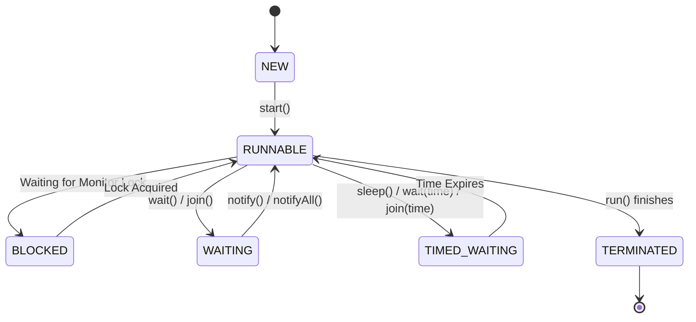
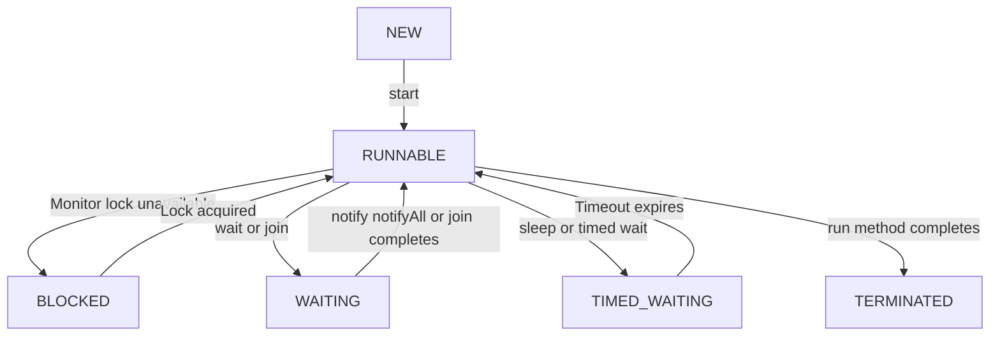

# 🔄 03. Thread Lifecycle

> [!NOTE]
> Every thread in Java goes through a series of states from its creation until its termination.
>
> Understanding the Thread Lifecycle is essential for mastering Java Multithreading and is one of the most frequently asked interview topics.

---

# 📚 Table of Contents

- [1. What is Thread Lifecycle?](#1-what-is-thread-lifecycle)
- [2. Why Do We Need Thread States?](#2-why-do-we-need-thread-states)
- [3. Thread States in Java](#3-thread-states-in-java)
- [4. Complete Lifecycle Diagram](#4-complete-lifecycle-diagram)
- [5. NEW State](#5-new-state)
- [6. RUNNABLE State](#6-runnable-state)
- [7. Thread Scheduler](#7-thread-scheduler)

---

# 1. What is Thread Lifecycle?

A **Thread Lifecycle** is the journey of a thread from its creation until it finishes execution.

Every thread follows predefined states managed by the JVM.

Conceptually,

```text
Thread Created
      │
      ▼
Thread Executes
      │
      ▼
Thread Waits (if required)
      │
      ▼
Thread Resumes
      │
      ▼
Thread Terminates
```

Java internally represents these stages using the `Thread.State` enumeration.

---

# 2. Why Do We Need Thread States?

Suppose multiple threads exist in an application.

```text
Thread A
Thread B
Thread C
Thread D
```

Some threads may be

- waiting for a lock
- sleeping
- waiting for another thread
- executing
- already finished

The JVM must know the current status of every thread.

Therefore, each thread has a **state**.

---

## Benefits

- JVM manages thread execution
- Scheduler knows which thread can run
- Easier debugging
- Useful for monitoring tools
- Helps avoid synchronization problems

---

# 3. Thread States in Java

Java defines **six** official thread states.

These are represented by

```java
Thread.State
```

The states are:

| State | Description |
|--------|-------------|
| NEW | Thread created but not started |
| RUNNABLE | Ready to run or currently executing |
| BLOCKED | Waiting to acquire a monitor lock |
| WAITING | Waiting indefinitely for another thread |
| TIMED_WAITING | Waiting for a specified amount of time |
| TERMINATED | Thread has completed execution |

---

## Visualization

```text
NEW

RUNNABLE

BLOCKED

WAITING

TIMED_WAITING

TERMINATED
```

---

# 4. Complete Lifecycle Diagram



> [!TIP]
> This is the official lifecycle that every Java thread follows.

---

# 5. NEW State

The **NEW** state represents a thread that has been created but has not yet started execution.

Example

```java
class MyThread extends Thread {

    @Override
    public void run() {

        System.out.println("Running");

    }

}

public class Main {

    public static void main(String[] args) {

        MyThread thread = new MyThread();

    }

}
```

The thread object exists.

However,

```java
thread.start();
```

has **not** been called.

Therefore,

its state is

```text
NEW
```

---

## Visualization

```text
Thread Object Created
         │
         ▼
       NEW
```

---

## Checking State

```java
class MyThread extends Thread {

    @Override
    public void run() {

    }

}

public class Main {

    public static void main(String[] args) {

        MyThread thread = new MyThread();

        System.out.println(thread.getState());

    }

}
```

Output

```text
NEW
```

---

## Characteristics of NEW State

- Thread object exists
- JVM has not started execution
- `run()` has not been invoked
- Scheduler is unaware of the thread
- Safe to configure thread properties

For example,

```java
thread.setName("Worker");

thread.setPriority(8);

thread.setDaemon(true);
```

These are typically configured before calling `start()`.

---

# 6. RUNNABLE State

The RUNNABLE state means the thread is ready to execute or is currently executing.

It enters this state when

```java
thread.start();
```

is called.

Example

```java
class MyThread extends Thread {

    @Override
    public void run() {

        for (int i = 1; i <= 5; i++) {

            System.out.println(i);

        }

    }

}

public class Main {

    public static void main(String[] args) {

        MyThread thread = new MyThread();

        thread.start();

    }

}
```

Execution

```text
Thread Created
        │
        ▼
     start()
        │
        ▼
    RUNNABLE
```

---

## Important Note

Many developers think

```text
RUNNABLE
```

means

```text
Running
```

This is **not completely correct**.

In Java,

RUNNABLE includes both

```text
Ready to Run

and

Currently Running
```

The JVM does not define a separate "Running" state.

---

## Visualization

```text
           CPU Available?
                 │
        ┌────────┴────────┐
        ▼                 ▼

Ready to Run         Currently Running

        └────────┬────────┘
                 ▼
             RUNNABLE
```

---

## Checking State

```java
class MyThread extends Thread {

    @Override
    public void run() {

        System.out.println(getState());

    }

}

public class Main {

    public static void main(String[] args) {

        MyThread thread = new MyThread();

        thread.start();

    }

}
```

The exact output may vary depending on timing because thread scheduling is nondeterministic.

> [!WARNING]
> Do not write logic that depends on observing a specific thread state at an exact moment.

---

# 7. Thread Scheduler

After calling

```java
thread.start();
```

the JVM places the thread in the **RUNNABLE** state.

Now the **Thread Scheduler** decides when the thread gets CPU time.

Visualization

```text
Thread-1
Thread-2
Thread-3
Thread-4
     │
     ▼
Thread Scheduler
     │
     ▼
CPU
```

The scheduler's decision depends on

- Operating System
- JVM implementation
- Available CPU cores
- Current workload
- Thread priority
- Scheduling policy

Because of this,

```text
thread1.start();

thread2.start();
```

does **not** guarantee

```text
Thread-1 executes first.
```

Execution order is **not deterministic**.

---

## Flow Until Now

```text
Create Thread Object
        │
        ▼
      NEW
        │
 thread.start()
        │
        ▼
    RUNNABLE
        │
Thread Scheduler
        │
        ▼
CPU Execution
```

---

# 8. BLOCKED State

A thread enters the **BLOCKED** state when it is waiting to acquire a **monitor lock** (also called an intrinsic lock).

This usually happens when another thread is already executing inside a `synchronized` block or method.

> [!NOTE]
> A thread in the **BLOCKED** state is **not waiting voluntarily**.
>
> It is waiting because another thread owns the required monitor lock.

---

## Example

```java
class Shared {

    synchronized void display() {

        try {

            Thread.sleep(5000);

        } catch (InterruptedException e) {

            Thread.currentThread().interrupt();

        }

    }

}

public class Main {

    public static void main(String[] args) {

        Shared shared = new Shared();

        Thread t1 = new Thread(() -> shared.display());

        Thread t2 = new Thread(() -> shared.display());

        t1.start();

        t2.start();

    }

}
```

### Execution

```text
Thread-1
     │
Acquires Lock
     │
Executes display()
     │
     ▼

Thread-2
     │
Needs Same Lock
     │
     ▼
BLOCKED
```

---

## Visualization

```text
                Monitor Lock
                     │
         ┌───────────┴───────────┐
         ▼                       ▼

     Thread-1              Thread-2
  Owns the Lock        Waiting for Lock
         │                       │
         ▼                       ▼
     RUNNING                 BLOCKED
```

---

## Characteristics

- Waiting for a monitor lock
- Cannot execute until lock becomes available
- Automatically becomes RUNNABLE after acquiring the lock
- Commonly seen with the `synchronized` keyword

> [!TIP]
> BLOCKED is related to **lock acquisition**, not waiting for time or notifications.

---

# 9. WAITING State

A thread enters the **WAITING** state when it waits indefinitely for another thread to perform a particular action.

Examples include:

- `wait()`
- `join()`
- `LockSupport.park()`

The thread remains waiting until another thread wakes it up.

---

## Example using `join()`

```java
class Worker extends Thread {

    @Override
    public void run() {

        System.out.println("Worker Finished");

    }

}

public class Main {

    public static void main(String[] args)
            throws InterruptedException {

        Worker worker = new Worker();

        worker.start();

        worker.join();

        System.out.println("Main Finished");

    }

}
```

Execution

```text
Main Thread
      │
      ▼
join()
      │
      ▼
WAITING
      │
Worker Finishes
      │
      ▼
RUNNABLE
```

---

## Example using `wait()`

```java
synchronized (obj) {

    obj.wait();

}
```

The thread waits until another thread calls

```java
obj.notify();
```

or

```java
obj.notifyAll();
```

---

## Visualization

```text
RUNNABLE
     │
 wait()
 join()
 park()
     │
     ▼
 WAITING
     │
notify()
join completes
unpark()
     │
     ▼
RUNNABLE
```

---

## Characteristics

- Waits indefinitely
- Releases the monitor when `wait()` is used
- Resumes only after another thread performs the required action

---

# 10. TIMED_WAITING State

A thread enters **TIMED_WAITING** when it waits for a specified amount of time.

Common methods are:

- `Thread.sleep()`
- `wait(long)`
- `join(long)`
- `parkNanos()`
- `parkUntil()`

---

## Example

```java
public class Main {

    public static void main(String[] args)
            throws InterruptedException {

        Thread.sleep(3000);

        System.out.println("Finished");

    }

}
```

Execution

```text
RUNNABLE
     │
sleep(3000)
     │
     ▼
TIMED_WAITING
     │
3 Seconds Complete
     │
     ▼
RUNNABLE
```

---

## Characteristics

- Waits for a fixed amount of time
- Automatically becomes RUNNABLE after timeout
- No notification is required

---

## WAITING vs TIMED_WAITING

| WAITING | TIMED_WAITING |
|----------|---------------|
| Waits indefinitely | Waits for a specified duration |
| Requires another thread to wake it | Automatically resumes after timeout |
| Example: `wait()` | Example: `sleep()` |

---

# 11. TERMINATED State

The final state of every thread.

A thread enters the **TERMINATED** state when

- `run()` completes normally
- an uncaught exception terminates the thread

---

## Example

```java
class Worker extends Thread {

    @Override
    public void run() {

        System.out.println("Working");

    }

}

public class Main {

    public static void main(String[] args)
            throws InterruptedException {

        Worker worker = new Worker();

        worker.start();

        worker.join();

        System.out.println(worker.getState());

    }

}
```

Output

```text
TERMINATED
```

---

## Visualization

```text
RUNNABLE
     │
run() finishes
     │
     ▼
TERMINATED
```

---

## Important

A terminated thread **cannot** be restarted.

Example

```java
Thread t = new Thread();

t.start();

t.start();
```

Output

```text
IllegalThreadStateException
```

## 12. Complete State Transition Flow


---

# 13. Using `getState()`

Java provides

```java
thread.getState();
```

to determine the current thread state.

Example

```java
Thread thread = new Thread();

System.out.println(thread.getState());
```

Output

```text
NEW
```

---

## Another Example

```java
Thread thread = new Thread(() -> {

});

thread.start();

System.out.println(thread.getState());
```

Possible Output

```text
RUNNABLE
```

or

```text
TERMINATED
```

depending on timing.

> [!WARNING]
> Thread states can change very quickly.
>
> The observed state depends on **when** `getState()` is called.

---

# 14. State Transition Summary

| Current State | Action | Next State |
|---------------|--------|------------|
| NEW | `start()` | RUNNABLE |
| RUNNABLE | Waiting for monitor | BLOCKED |
| BLOCKED | Lock acquired | RUNNABLE |
| RUNNABLE | `wait()` | WAITING |
| WAITING | `notify()` | RUNNABLE |
| RUNNABLE | `sleep()` | TIMED_WAITING |
| TIMED_WAITING | Timeout expires | RUNNABLE |
| RUNNABLE | `run()` completes | TERMINATED |

---

---

# 15. State Comparison

Understanding the differences between thread states is very important for interviews.

| State | Meaning | How It Enters | How It Leaves |
|-------|---------|---------------|---------------|
| **NEW** | Thread object created but not started | `new Thread()` | `start()` |
| **RUNNABLE** | Ready to run or currently executing | `start()` | Scheduler, waiting for lock, waiting methods, termination |
| **BLOCKED** | Waiting to acquire a monitor lock | Entering a synchronized block while lock is held | Lock becomes available |
| **WAITING** | Waiting indefinitely | `wait()`, `join()`, `LockSupport.park()` | `notify()`, `notifyAll()`, thread completion, `unpark()` |
| **TIMED_WAITING** | Waiting for a fixed duration | `sleep()`, `wait(timeout)`, `join(timeout)` | Timeout expires |
| **TERMINATED** | Execution finished | `run()` completes | Final state |

---

# 16. Lifecycle Example

```java
class Worker extends Thread {

    @Override
    public void run() {

        System.out.println("Running...");

    }

}

public class Main {

    public static void main(String[] args)
            throws InterruptedException {

        Worker worker = new Worker();

        System.out.println(worker.getState());

        worker.start();

        System.out.println(worker.getState());

        worker.join();

        System.out.println(worker.getState());

    }

}
```

Possible Output

```text
NEW
RUNNABLE
TERMINATED
```

> [!NOTE]
> The second output may sometimes appear as `TERMINATED` if the child thread finishes before `getState()` is executed.

---

# 17. JVM Internals

When we call

```java
thread.start();
```

the following happens internally:

```text
Thread Object
      │
      ▼
JVM Requests Native Thread
      │
      ▼
Operating System Creates Thread
      │
      ▼
Thread Enters RUNNABLE State
      │
      ▼
Scheduler Selects Thread
      │
      ▼
run() Method Executes
      │
      ▼
TERMINATED
```

The JVM works together with the **Operating System's scheduler** to manage thread execution.

> [!TIP]
> Java does **not** directly execute threads. It delegates scheduling to the underlying operating system.

---

# 18. Common Misconceptions

## ❌ Misconception 1

RUNNABLE means Running.

**Reality**

RUNNABLE means

- Ready to Run
- Running

Both are represented by the same state.

---

## ❌ Misconception 2

Calling `start()` immediately starts execution.

**Reality**

`start()` only makes the thread eligible for execution.

The scheduler decides when it actually runs.

---

## ❌ Misconception 3

BLOCKED and WAITING are the same.

**Reality**

| BLOCKED | WAITING |
|----------|----------|
| Waiting for a monitor lock | Waiting for another thread's action |
| Caused by synchronization | Caused by `wait()`, `join()`, etc. |

---

## ❌ Misconception 4

A terminated thread can be restarted.

```java
thread.start();
thread.start();
```

Output

```text
IllegalThreadStateException
```

A thread can be started only once.

---

# 19. Frequently Asked Interview Questions

## 1. How many thread states exist in Java?

Java defines **six** thread states.

- NEW
- RUNNABLE
- BLOCKED
- WAITING
- TIMED_WAITING
- TERMINATED

---

## 2. Which class represents thread states?

```java
Thread.State
```

---

## 3. Does Java have a RUNNING state?

No.

Java combines **Ready to Run** and **Running** into the **RUNNABLE** state.

---

## 4. What is the difference between BLOCKED and WAITING?

BLOCKED waits for a monitor lock.

WAITING waits for another thread's action.

---

## 5. Which methods cause TIMED_WAITING?

- `sleep()`
- `wait(timeout)`
- `join(timeout)`

---

## 6. Which methods cause WAITING?

- `wait()`
- `join()`
- `LockSupport.park()`

---

## 7. Can a thread move from TERMINATED to RUNNABLE?

No.

Once terminated, the thread's lifecycle is complete.

---

## 8. What does `getState()` return?

It returns the current state of the thread as a `Thread.State` enum value.

---

## 9. Can `getState()` always return the same value?

No.

Thread states change rapidly, so the result depends on the exact moment it is called.

---

# 20. Quick Revision

```text
                 Thread Lifecycle

        new Thread()
              │
              ▼
            NEW
              │
          start()
              │
              ▼
          RUNNABLE
      ┌───────┼────────┐
      ▼       ▼        ▼
 BLOCKED   WAITING   TIMED_WAITING
      │       │        │
      └───────┼────────┘
              ▼
          RUNNABLE
              │
      run() completes
              │
              ▼
         TERMINATED
```

---

# 🎯 SDE Checklist

After completing this topic, you should be able to answer:

- [x] What is Thread Lifecycle?
- [x] Explain all six thread states.
- [x] Difference between NEW and RUNNABLE.
- [x] Difference between BLOCKED and WAITING.
- [x] Difference between WAITING and TIMED_WAITING.
- [x] When does a thread enter TERMINATED?
- [x] How does `getState()` work?
- [x] Why doesn't Java have a RUNNING state?
- [x] Can a terminated thread be restarted?
- [x] Explain the complete lifecycle diagram.

---

# 📝 Key Takeaways

- Every thread follows a fixed lifecycle managed by the JVM.
- Java defines **six** official thread states.
- `RUNNABLE` includes both **ready-to-run** and **currently running** threads.
- `BLOCKED` is caused by waiting for a monitor lock.
- `WAITING` is caused by waiting indefinitely for another thread.
- `TIMED_WAITING` waits for a specific duration.
- `TERMINATED` is the final state and cannot transition to any other state.

> [!TIP]
> **Interview Shortcut**
>
> - **BLOCKED → Waiting for Lock**
> - **WAITING → Waiting for Notification**
> - **TIMED_WAITING → Waiting for Time**
> - **TERMINATED → Finished Execution**

---

# 📖 Next Topic

➡️ **04_Synchronization.md**

In the next chapter, we'll cover one of the most important multithreading topics:

- Race Condition
- Critical Section
- Thread Safety
- Synchronization
- Object Lock
- Class Lock
- Synchronization Internals
- JVM Monitor
- Real-world Examples

> ⭐ **Synchronization is one of the highest-priority Java multithreading topics for SDE interviews.**
